# GitOps Deployment with Jenkins, GitLab, Nexus, Argo CD, MetalLB, and Kubernetes

> **Environment:** In-house data center Kubernetes cluster  
> **Application:** Microservices e-commerce platform  
> **Git repository:** `microservices-e-commerce-eks-project`  
> **Deployment namespace:** `dev`  
> **Container registry:** `nexus.openhelp.net/docker-private/sreejith`  
> **GitLab:** `https://gitlab.openhelp.net`  
> **Argo CD LoadBalancer IP:** `192.168.0.242`  
> **Frontend LoadBalancer IP example:** `192.168.0.241`

---

## 1. Architecture


### End-to-end flow

```mermaid
flowchart LR
    A["Developer updates<br/>src/service"] --> B["Jenkins CI"]
    B --> C["Build container image"]
    C --> D["Push image to Nexus"]
    B --> E["Update Kubernetes YAML"]
    E --> F["Create GitOps branch"]
    F --> G["GitLab Merge Request"]
    G --> H["Reviewer / Approver"]
    H --> I["Merge into protected main"]
    I --> J["Argo CD detects change"]
    J --> K["Argo CD syncs cluster"]
    K --> L["Kubernetes rolling update"]

    style A fill:#dbeafe,stroke:#2563eb
    style B fill:#ffedd5,stroke:#ea580c
    style D fill:#ccfbf1,stroke:#0f766e
    style G fill:#fce7f3,stroke:#db2777
    style H fill:#fef3c7,stroke:#d97706
    style J fill:#ede9fe,stroke:#7c3aed
    style K fill:#dcfce7,stroke:#16a34a
    style L fill:#dcfce7,stroke:#15803d
```



---

## 2. What is GitOps?

GitOps is an operating model in which Git is the authoritative source for the desired state of an application and its infrastructure.

In this implementation:

- Application source code is stored under `src/`.
- Jenkins builds and pushes container images to Nexus.
- Kubernetes manifests are stored under `kubernetes-files/`.
- Jenkins updates the image tag in the relevant Kubernetes manifest.
- Jenkins creates a separate GitOps branch and a GitLab Merge Request.
- A **Reviewer / Approver** validates the change.
- Only approved changes are merged into protected `main`.
- Argo CD continuously compares `main/kubernetes-files` with the live Kubernetes cluster.
- Argo CD applies approved differences to the cluster.
- Kubernetes performs the rolling update.

### CI versus CD responsibility

| Component | Responsibility |
|---|---|
| Developer | Changes application code |
| Jenkins | Builds, tests, packages, pushes the image, and proposes a manifest change |
| Nexus | Stores immutable container images |
| GitLab | Stores source/manifests and controls review and approval |
| Reviewer / Approver | Validates the proposed deployment change |
| Argo CD | Reconciles approved Git state with Kubernetes |
| Kubernetes | Runs the workloads and performs rollouts |
| MetalLB | Assigns external IP addresses to `LoadBalancer` Services |

The key principle is:

```text
Jenkins proposes the deployment change.
GitLab records and approves the change.
Argo CD performs the deployment.
```

Jenkins should not directly run `kubectl apply` in this GitOps design.

---

## 3. Repository structure verified for this project

The supplied project contains per-service source directories, Jenkinsfiles, and Kubernetes manifests.

```text
microservices-e-commerce-eks-project/
├── jenkinsfiles/
│   ├── adservice
│   ├── cartservice
│   ├── checkoutservice
│   ├── currencyservice
│   ├── emailservice
│   ├── frontend
│   ├── loadgenerator
│   ├── paymentservice
│   ├── productcatalogservice
│   ├── recommendationservice
│   └── shippingservice
├── kubernetes-files/
│   ├── adservice.yaml
│   ├── cartservice.yaml
│   ├── checkoutservice.yaml
│   ├── currencyservice.yaml
│   ├── emailservice.yaml
│   ├── frontend.yaml
│   ├── loadgenerator.yaml
│   ├── paymentservice.yaml
│   ├── productcatalogservice.yaml
│   ├── recommendationservice.yaml
│   ├── redis-cart.yaml
│   └── shippingservice.yaml
└── src/
    ├── adservice/
    ├── cartservice/
    ├── checkoutservice/
    ├── currencyservice/
    ├── emailservice/
    ├── frontend/
    ├── loadgenerator/
    ├── paymentservice/
    ├── productcatalogservice/
    ├── recommendationservice/
    └── shippingservice/
```

The Jenkins pipelines follow this pattern:

```text
Clean workspace
→ Clone main
→ Build service image
→ Login to Nexus
→ Push image with Jenkins BUILD_NUMBER
→ Update kubernetes-files/<service>.yaml
→ Create gitops-<service>-<BUILD_NUMBER> branch
→ Push branch
→ Create Merge Request targeting main
```

The Kubernetes manifests deploy the services into namespace `dev` and use:

```yaml
imagePullSecrets:
  - name: nexus-secret
```

The frontend manifest provides:

- `frontend`: internal `ClusterIP`
- `frontend-external`: external `LoadBalancer`

---

# PART I — Prepare Jenkins, GitLab and migrate the repository
## 4.0 Configure jenkins plugins


### Navigation

```text
Jenkins → Manage Jenkins → Plugins
```

### Install the following plugins

```text
Eclipse Temurin installer Plugin
Config File Provider Plugin
Pipeline Maven Integration
Docker Pipeline
Docker plugin
SonarQube Scanner for Jenkins
Kubernetes plugin
Kubernetes Credentials
Kubernetes CLI Plugin
Kubernetes Client API Plugin
Maven Integration plugin
Pipeline Maven Integration
Pipeline Maven Plugin API
Pipeline: Stage View Plugin
Docker
Docker Commons
Docker Pipeline
Docker API
docker-build-step
Pipeline Stage View
Email Extension Plugin
Prometheus metrics
```

### Explanation

These plugins provide:

- Automatic JDK installation
- Maven integration
- Docker build and push support
- SonarQube integration
- Kubernetes access
- Managed Maven settings
- Pipeline-stage visualization

> Some entries may overlap because one plugin can install related dependencies automatically. Keeping all listed entries ensures the required functionality is available.

---

## 3. Configure Jenkins Tools

### Navigation

```text
Jenkins → Manage Jenkins → Tools
```

---

### 3.1 Configure JDK 17

Click:

```text
JDK installations → Add JDK
```

Configure:

```text
Name: jdk17
Install automatically: Enabled
Installer: Install from adoptium.net
Version: jdk-17.0.19+10
```

### Explanation

The name `jdk17` must exactly match the tool name referenced in the Jenkins pipeline.

Example:

```groovy
tools {
    jdk 'jdk17'
}
```

---

### 3.2 Configure SonarQube Scanner

Click:

```text
SonarQube Scanner installations → Add SonarQube Scanner
```

Configure:

```text
Name: sonar-scanner
Install automatically: Enabled
Installer: Install from Maven Central
Version: SonarQube Scanner 8.1.0.6389
```

### Explanation

The name `sonar-scanner` is later referenced by the Jenkins pipeline.

Example:

```groovy
SCANNER_HOME = tool 'sonar-scanner'
```

---

### 3.3 Configure Maven

Click:

```text
Maven installations → Add Maven
```

Configure:

```text
Name: Maven3.9.15
Install automatically: Enabled
Installer: Install from Apache
Version: 3.9.15
```

### Explanation

The name must match the Jenkinsfile tool declaration.

```groovy
tools {
    maven 'Maven3.9.15'
}
```

---

### 3.4 Configure Docker

Click:

```text
Docker installations → Add Docker
```

Configure:

```text
Name: docker
Install automatically: Enabled
Installer: Download from docker.com
Docker version: latest
```

### Explanation

This makes the Docker CLI available to Jenkins jobs that use the configured tool.

---

## 4. Configure Jenkins Credentials

### Navigation

```text
Jenkins → Manage Jenkins → Credentials
```

Select:

```text
Add credentials>> Username with password>> global
```

---

### 4.1 GitLab Credentials

Select:

```text
Kind: Username with password
Scope: Global
```

Configure:

```text
Username: sreejith
Password: <GITLAB_ACCESS_TOKEN>
ID: sreejithgit
Description: sreejithgit
```

### Explanation

The password field stores the GitLab personal access token. The Jenkins pipeline refers to the credential by ID:

```groovy
credentialsId: 'sreejithgit'
```

---

### 4.2 Nexus Credentials

Select:

```text
Kind: Username with password
Scope: Global
```

Configure:

```text
Username: admin
Password: <NEXUS_PASSWORD>
ID: nexus-cred
Description: nexus-cred
```

### Explanation

Use a Nexus account that has permission to:

- Upload Maven artifacts
- Push Docker images
- Read required repositories

Avoid using the Nexus administrator account in production. Create a dedicated service account with only the required privileges.

---

### 4.3 Gmail Credentials

Select:

```text
Kind: Username with password
Scope: Global
```

Configure:

```text
Username: sreejithedl@gmail.com
Password: <GMAIL_APPLICATION_PASSWORD>
ID: mail-cred
Description: mail-cred
```

### Explanation

Use a Gmail application password, not the normal Gmail account password.

Also go to:

Jenkins
→ Manage Jenkins
→ System

Find:

Jenkins Location

and set:
System Admin e-mail address: sreejithedl@gmail.com

This is the one we configured with Gmail SMTP

---

---

## 8. Configure Gmail SMTP in Jenkins

Navigate to:

```text
Jenkins → Manage Jenkins → System
```

Find:

```text
Extended E-mail Notification
```

Configure:

```text
SMTP server: smtp.gmail.com
SMTP port: 465
Credentials: mail-cred
Use SSL: Enabled
```

Save the configuration.

Restart Jenkins only if required.

### Explanation

Port `465` uses SMTP over SSL. The `mail-cred` Jenkins credential supplies the Gmail address and application password.

---


## 4.1. Clone the GitHub repository

Run this on the workstation or server used for repository migration:

```bash
git clone https://github.com/openhelpdevops/devops_project4_microservices-e-commerce-eks-project.git

cd devops_project4_microservices-e-commerce-eks-project
```

Verify the current remote:

```bash
git remote -v
```

Expected initial result:

```text
origin  https://github.com/openhelpdevops/devops_project4_microservices-e-commerce-eks-project.git (fetch)
origin  https://github.com/openhelpdevops/devops_project4_microservices-e-commerce-eks-project.git (push)
```

> The cloned directory normally does **not** end with `.git`. The `.git` directory is hidden inside the working directory.

---

## 5. Create the GitLab project

From the GitLab UI:

```text
GitLab
→ New project
→ Create blank project
```

Use:

```text
Project name: microservices-e-commerce-eks-project
Project slug: microservices-e-commerce-eks-project
Visibility: Private
Initialize repository with README: Disabled
```

Do not initialize the GitLab project with a README when migrating an existing Git history. This avoids unrelated-history conflicts.

The target repository is:

```text
https://gitlab.openhelp.net/sreejith/microservices-e-commerce-eks-project.git
```

---

## 6. Replace the GitHub remote with GitLab

Remove the original remote:

```bash
git remote remove origin
```

Add the GitLab remote:

```bash
git remote add origin \
  https://gitlab.openhelp.net/sreejith/microservices-e-commerce-eks-project.git
```

Verify it:

```bash
git remote -v
```

Expected:

```text
origin  https://gitlab.openhelp.net/sreejith/microservices-e-commerce-eks-project.git (fetch)
origin  https://gitlab.openhelp.net/sreejith/microservices-e-commerce-eks-project.git (push)
```

> The command `git add origin ...` is invalid. The correct command is `git remote add origin ...`.

---

## 7. Push a migration branch

Create and switch to a branch named `migration`:

```bash
git switch -c migration
```

For older Git versions:

```bash
git checkout -b migration
```

Check the current branch:

```bash
git branch
```

Push the branch:

```bash
git push -u origin migration
```

After verifying the repository in GitLab, create a Merge Request:

```text
Source branch: migration
Target branch: main
```

Review and merge it.

### Alternative: push the existing branch as `main`

If the local repository already has the correct `main` branch and the GitLab repository is empty:

```bash
git switch main
git push -u origin main
```

---

## 8. Protect the `main` branch

In GitLab:

```text
Project
→ Settings
→ Repository
→ Protected branches
```

Recommended settings:

```text
Branch: main
Allowed to merge: Maintainers
Allowed to push and merge: No one
Allowed to force push: Disabled
```

This prevents Jenkins and developers from bypassing Merge Requests.

---

## 9. Configure reviewers and approval rules

For a production-style workflow, use a technical group such as:

```text
gitops-reviewers
platform-approvers
production-approvers
service-owners
```

A suitable approval rule is:

```text
Rule name: GitOps deployment approval
Approvers: gitops-reviewers
Approvals required: 1
Target branch: main
```

This means any one eligible reviewer in the group can approve the deployment change.

> Approval rules that block merging can depend on the GitLab license tier. Verify the features available in your self-managed GitLab edition.

---

# PART II — Understand the Jenkins GitOps behavior

## 10. Container image convention

Each service pipeline builds an image such as:

```text
nexus.openhelp.net/docker-private/sreejith/checkoutservice:25
```

Here:

```text
checkoutservice = service name
25              = Jenkins BUILD_NUMBER
```

The image is then written into:

```text
kubernetes-files/checkoutservice.yaml
```

Example:

```yaml
containers:
  - name: server
    image: nexus.openhelp.net/docker-private/sreejith/checkoutservice:25
```

---

## 11. GitOps branch and Merge Request

The checkout service Jenkinsfile creates a branch such as:

```text
gitops-checkoutservice-25
```

It pushes the branch with GitLab push options:

```bash
git push \
  "https://gitlab.openhelp.net/sreejith/microservices-e-commerce-eks-project.git" \
  "HEAD:${GITOPS_BRANCH}" \
  -o merge_request.create \
  -o merge_request.target=main \
  -o merge_request.remove_source_branch \
  -o merge_request.title="Deploy checkoutservice image ${TAG}"
```

GitLab then creates:

```text
gitops-checkoutservice-25 → main
```

The reviewer checks:

- Correct service
- Correct image repository
- Correct image tag
- Only the intended YAML was changed
- No unexpected security, resource, port, or environment changes
- Jenkins image push completed successfully

After approval, an authorized user merges the MR into `main`.

---

## 12. Why Argo CD waits for the merge

Argo CD will be configured to monitor:

```text
Repository: https://gitlab.openhelp.net/sreejith/microservices-e-commerce-eks-project.git
Revision: main
Path: kubernetes-files
```

It does not deploy the GitOps feature branch because the application tracks `main`.

Before merge:

```text
main contains checkoutservice:24
cluster runs checkoutservice:24
Argo CD status: Synced
```

After merge:

```text
main contains checkoutservice:25
cluster runs checkoutservice:24
Argo CD status: OutOfSync
```

With automatic sync enabled, Argo CD applies the new desired state and Kubernetes starts the rollout.

---

# PART III — Install Argo CD

## 13. Prerequisites

Confirm the following before installation:

```bash
kubectl get nodes
kubectl get pods -A
```

You need:

- A working Kubernetes cluster
- `kubectl` configured with cluster-admin permissions
- MetalLB installed and configured
- Network connectivity from Kubernetes pods to GitLab
- DNS resolution for `gitlab.openhelp.net`
- A trusted GitLab TLS certificate or internal CA certificate
- An unused MetalLB address for Argo CD, for example `192.168.0.242`

---

## 14. Verify MetalLB

Check MetalLB components:

```bash
kubectl get pods -n metallb-system
kubectl get ipaddresspools -n metallb-system
kubectl get l2advertisements -n metallb-system
```

A Layer 2 MetalLB configuration generally requires an `IPAddressPool` and an `L2Advertisement`.


---

## 15. Create the Argo CD namespace

```bash
kubectl create namespace argocd
```

Verify:

```bash
kubectl get namespace argocd
```

---

## 16. Install Argo CD

For reproducible production installation, pin a reviewed Argo CD release instead of permanently relying on an unpinned URL.

The common stable installation command is:

```bash
kubectl apply --server-side --force-conflicts \
  -n argocd \
  -f https://raw.githubusercontent.com/argoproj/argo-cd/stable/manifests/install.yaml
```

Wait for all deployments:

```bash
kubectl rollout status deployment/argocd-server -n argocd --timeout=300s
kubectl rollout status deployment/argocd-repo-server -n argocd --timeout=300s
kubectl rollout status deployment/argocd-applicationset-controller -n argocd --timeout=300s
```

Wait for the application controller StatefulSet:

```bash
kubectl rollout status statefulset/argocd-application-controller \
  -n argocd \
  --timeout=300s
```

---

## 17. Verify Argo CD resources

To list the main workload resources:

```bash

root@kube2:~# kubectl get all -n argocd
NAME                                                    READY   STATUS    RESTARTS       AGE
pod/argocd-application-controller-0                     1/1     Running   0              3m27s
pod/argocd-applicationset-controller-7f7b6c9856-xmgts   1/1     Running   0              3m32s
pod/argocd-dex-server-6b857cf79c-bfxwr                  1/1     Running   1 (118s ago)   3m32s
pod/argocd-notifications-controller-5f5fbbbd8-mszsp     1/1     Running   0              3m32s
pod/argocd-redis-65fc4c87dc-tgb6g                       1/1     Running   0              3m31s
pod/argocd-repo-server-7c4b587448-v6tmk                 1/1     Running   0              3m30s
pod/argocd-server-767dfcb8f9-mr48w                      1/1     Running   0              3m29s

NAME                                              TYPE        CLUSTER-IP       EXTERNAL-IP   PORT(S)                      AGE
service/argocd-applicationset-controller          ClusterIP   10.101.41.212    <none>        7000/TCP,8080/TCP            3m34s
service/argocd-dex-server                         ClusterIP   10.102.21.19     <none>        5556/TCP,5557/TCP,5558/TCP   3m34s
service/argocd-metrics                            ClusterIP   10.107.251.144   <none>        8082/TCP                     3m34s
service/argocd-notifications-controller-metrics   ClusterIP   10.109.206.158   <none>        9001/TCP                     3m34s
service/argocd-redis                              ClusterIP   10.101.207.149   <none>        6379/TCP                     3m33s
service/argocd-repo-server                        ClusterIP   10.102.246.57    <none>        8081/TCP,8084/TCP            3m33s
service/argocd-server                             ClusterIP   10.103.115.96    <none>        80/TCP,443/TCP               3m33s
service/argocd-server-metrics                     ClusterIP   10.102.29.187    <none>        8083/TCP                     3m33s

NAME                                               READY   UP-TO-DATE   AVAILABLE   AGE
deployment.apps/argocd-applicationset-controller   1/1     1            1           3m32s
deployment.apps/argocd-dex-server                  1/1     1            1           3m32s
deployment.apps/argocd-notifications-controller    1/1     1            1           3m32s
deployment.apps/argocd-redis                       1/1     1            1           3m32s
deployment.apps/argocd-repo-server                 1/1     1            1           3m31s
deployment.apps/argocd-server                      1/1     1            1           3m30s

NAME                                                          DESIRED   CURRENT   READY   AGE
replicaset.apps/argocd-applicationset-controller-7f7b6c9856   1         1         1       3m32s
replicaset.apps/argocd-dex-server-6b857cf79c                  1         1         1       3m32s
replicaset.apps/argocd-notifications-controller-5f5fbbbd8     1         1         1       3m32s
replicaset.apps/argocd-redis-65fc4c87dc                       1         1         1       3m32s
replicaset.apps/argocd-repo-server-7c4b587448                 1         1         1       3m30s
replicaset.apps/argocd-server-767dfcb8f9                      1         1         1       3m29s

NAME                                             READY   AGE
statefulset.apps/argocd-application-controller   1/1     3m29s

```

Typical resources include:

```text
argocd-application-controller
argocd-applicationset-controller
argocd-dex-server
argocd-notifications-controller
argocd-redis
argocd-repo-server
argocd-server
```

Note that `kubectl get all` does not literally display every Kubernetes resource type. To inspect important additional objects:

```bash
kubectl get secrets -n argocd
kubectl get configmaps -n argocd
kubectl get serviceaccounts -n argocd
kubectl get roles,rolebindings -n argocd
kubectl get applications.argoproj.io -n argocd
kubectl get appprojects.argoproj.io -n argocd
```

For a broad namespaced listing:

```bash
kubectl api-resources --verbs=list --namespaced -o name |
while read resource; do
  kubectl get "$resource" -n argocd --ignore-not-found
done
```

---

# PART IV — Expose Argo CD through 

```text
root@kube2:~#  kubectl get svc -n argocd
NAME                                      TYPE        CLUSTER-IP       EXTERNAL-IP   PORT(S)                      AGE
argocd-applicationset-controller          ClusterIP   10.101.41.212    <none>        7000/TCP,8080/TCP            4m26s
argocd-dex-server                         ClusterIP   10.102.21.19     <none>        5556/TCP,5557/TCP,5558/TCP   4m26s
argocd-metrics                            ClusterIP   10.107.251.144   <none>        8082/TCP                     4m26s
argocd-notifications-controller-metrics   ClusterIP   10.109.206.158   <none>        9001/TCP                     4m26s
argocd-redis                              ClusterIP   10.101.207.149   <none>        6379/TCP                     4m25s
argocd-repo-server                        ClusterIP   10.102.246.57    <none>        8081/TCP,8084/TCP            4m25s
argocd-server                             ClusterIP   10.103.115.96    <none>        80/TCP,443/TCP               4m25s
argocd-server-metrics                     ClusterIP   10.102.29.187    <none>        8083/TCP                     4m25s
```
Because Kubernetes deploys services to arbitrary network addresses inside your cluster, you’ll need to forward the relevant ports in order to access them from your local machine. 
Argo CD sets up a service named argocd-server on port 443 internally. Because port 443 is the default HTTPS port, and you may be running some other HTTP/HTTPS services,
it’s common practice to forward those to arbitrarily chosen other ports, like 8080, like so:


## 18. Change `argocd-server` to `LoadBalancer`

The default service is `ClusterIP`.

Patch it:

```bash
kubectl patch service argocd-server \
  -n argocd \
  --type merge \
  -p '{"spec":{"type":"LoadBalancer"}}'
```

Request the desired MetalLB address:

```bash
kubectl annotate service argocd-server \
  -n argocd \
  metallb.io/loadBalancerIPs=192.168.0.242 \
  --overwrite
```

Watch the service:

```bash
kubectl get service argocd-server -n argocd -w
```

Expected:

```text
NAME            TYPE           CLUSTER-IP      EXTERNAL-IP     PORT(S)
argocd-server   LoadBalancer   10.x.x.x        192.168.0.242   80:xxxxx/TCP,443:xxxxx/TCP
```

Confirm:

```bash
kubectl describe service argocd-server -n argocd
```

Access the UI:

```text
https://192.168.0.242
```


A browser warning is expected when the Argo CD API server presents its default self-signed certificate.

---

## 19. Retrieve the initial Argo CD password


```bash
kubectl -n argocd get secret argocd-initial-admin-secret \
  -o jsonpath="{.data.password}" |
base64 -d

echo
```

Login details:

```text
Username: admin
Password: value returned by the command
```

Immediately change the initial password after login.

Do not store the password in Git, Jenkinsfiles, shell history, screenshots, or documentation.

---

# PART V — Configure cluster DNS for the internal GitLab hostname

## 20. Test DNS from the cluster first

Do not edit CoreDNS unless name resolution actually fails.

Run:

```bash
kubectl run dns-test \
  --image=busybox:1.36 \
  --restart=Never \
  --rm -it \
  -- nslookup gitlab.openhelp.net
```

Also test HTTPS connectivity:

```bash
kubectl run curl-test \
  --image=curlimages/curl:latest \
  --restart=Never \
  --rm -it \
  -- curl -vk https://gitlab.openhelp.net
```

If internal DNS already resolves the hostname, no CoreDNS `hosts` entry is needed. its failed so goahread with below steps

---

## 21. Recommended DNS solution

The preferred design is to create this record in your internal DNS system:

```text
gitlab.openhelp.net → 192.168.0.21
```

Then ensure Kubernetes nodes and CoreDNS can query that DNS server.

This is easier to maintain than hard-coding host entries in the CoreDNS ConfigMap.

---

## 22. Lab fallback: add a CoreDNS hosts entry

For this lab, edit CoreDNS:

```bash
kubectl edit configmap coredns -n kube-system
```

Add the `hosts` block inside `.:53`:

```yaml
apiVersion: v1
kind: ConfigMap
metadata:
  name: coredns
  namespace: kube-system
data:
  Corefile: |
    .:53 {
        errors

        health {
           lameduck 5s
        }

        ready

        hosts {
           192.168.0.21 gitlab.openhelp.net
           fallthrough
        }

        kubernetes cluster.local in-addr.arpa ip6.arpa {
           pods insecure
           fallthrough in-addr.arpa ip6.arpa
           ttl 30
        }

        prometheus :9153

        forward . /etc/resolv.conf {
           max_concurrent 1000
        }

        cache 30
        loop
        reload
        loadbalance
    }
```

Restart CoreDNS:

```bash
kubectl rollout restart deployment coredns -n kube-system
kubectl rollout status deployment coredns -n kube-system
```

Test again:

```bash
kubectl run dns-test \
  --image=busybox:1.36 \
  --restart=Never \
  --rm -it \
  -- nslookup gitlab.openhelp.net
```

---

# PART VI — Install and configure the Argo CD CLI

## 23. Download the CLI

For AMD64 Linux:

```bash
root@kube2:~# wget \
  https://github.com/argoproj/argo-cd/releases/latest/download/argocd-linux-amd64
```

Install it:

```bash
root@kube2:~# sudo install -m 0555 argocd-linux-amd64 /usr/local/bin/argocd
```

Verify:

```bash
root@kube2:~# argocd version --client
```

> In production, pin and verify an approved CLI version matching your Argo CD server release.

---

## 24. Log in through the LoadBalancer IP

Store the password without displaying it in command history:

```bash
ARGOCD_PASSWORD="$(
  kubectl -n argocd get secret argocd-initial-admin-secret \
    -o jsonpath='{.data.password}' |
  base64 -d
)"
```

Login:

```bash
argocd login 192.168.0.242 \
  --username admin \
  --password "${ARGOCD_PASSWORD}" \
  --insecure
```

Expected:

```text
'admin:login' logged in successfully
Context '192.168.0.242' updated
```

`--insecure` applies to the Argo CD API server connection because its default certificate is self-signed. It should not be confused with Git repository TLS validation.

---

# PART VII — Trust the internal GitLab TLS certificate

## 25. Export the CA certificate correctly

Download ca certificate from gitlab server

```text
root@kube2:~# scp root@gitlab.openhelp.net:/etc/ipa/ca.crt /root/gitlab-ca.crt
```

List the certificates

```bash
root@kube2:~# argocd cert list
HOSTNAME                 TYPE   SUBTYPE              INFO
[ssh.github.com]:443     ssh    ecdsa-sha2-nistp256  SHA256:p2QAMXNIC1TJYWeIOttrVc98/R1BUFWu3/LiyKgUfQM
[ssh.github.com]:443     ssh    ssh-ed25519          SHA256:+DiY3wvvV6TuJJhbpZisF/zLDA0zPMSvHdkr4UvCOqU
[ssh.github.com]:443     ssh    ssh-rsa              SHA256:uNiVztksCsDhcc0u9e8BujQXVUpKZIDTMczCvj3tD2s
bitbucket.org            ssh    ecdsa-sha2-nistp256  SHA256:FC73VB6C4OQLSCrjEayhMp9UMxS97caD/Yyi2bhW/J0
bitbucket.org            ssh    ssh-ed25519          SHA256:ybgmFkzwOSotHTHLJgHO0QN8L0xErw6vd0VhFA9m3SM
bitbucket.org            ssh    ssh-rsa              SHA256:46OSHA1Rmj8E8ERTC6xkNcmGOw9oFxYr0WF6zWW8l1E
github.com               ssh    ecdsa-sha2-nistp256  SHA256:p2QAMXNIC1TJYWeIOttrVc98/R1BUFWu3/LiyKgUfQM
github.com               ssh    ssh-ed25519          SHA256:+DiY3wvvV6TuJJhbpZisF/zLDA0zPMSvHdkr4UvCOqU
github.com               ssh    ssh-rsa              SHA256:uNiVztksCsDhcc0u9e8BujQXVUpKZIDTMczCvj3tD2s
gitlab.com               ssh    ecdsa-sha2-nistp256  SHA256:HbW3g8zUjNSksFbqTiUWPWg2Bq1x8xdGUrliXFzSnUw
gitlab.com               ssh    ssh-ed25519          SHA256:eUXGGm1YGsMAS7vkcx6JOJdOGHPem5gQp4taiCfCLB8
gitlab.com               ssh    ssh-rsa              SHA256:ROQFvPThGrW4RuWLoL9tq9I9zJ42fK4XywyRtbOz/EQ
gitlab.openhelp.net      https  rsa                  CN=Certificate Authority,O=OPENHELP.NET
ssh.dev.azure.com        ssh    ssh-rsa              SHA256:ohD8VZEXGWo6Ez8GSEJQ9WpafgLFsOfLOtGGQCQo6Og
vs-ssh.visualstudio.com  ssh    ssh-rsa              SHA256:ohD8VZEXGWo6Ez8GSEJQ9WpafgLFsOfLOtGGQCQo6Og

```
Remove existing https certificates
```bash
argocd cert rm --cert-type https gitlab.openhelp.net
```

Add the GitLab CA certificate to Argo CD

```bash
argocd cert add-tls   --from /root/gitlab-ca.crt   gitlab.openhelp.net
```

The CA certificate is preferable because the server certificate may be renewed.

---

Verify:

```bash
argocd cert list
```

You should see:

```text
gitlab.openhelp.net      https  rsa                  CN=Certificate Authority,O=OPENHELP.NET
```

Never use `--insecure-skip-server-verification` as a permanent production workaround.

---

# PART VIII — Add the private GitLab repository

## 27. Create a GitLab token

In GitLab:

```text
User avatar
→ Edit profile
→ Access
→Personal Access tokens
```

Create a token dedicated to Argo CD.

Recommended minimum repository permission:

```text
read_repository
```

Use a meaningful name and expiration:

```text
Name: argocd-repository-read
Expiration: organization-approved date
```

For stronger isolation, prefer a GitLab Project Access Token, Deploy Token, or dedicated service account instead of a personal user token.

---

## 28. Add the repository with the CLI

Avoid putting the token directly into shell history.

Prompt for it:

```bash
read -rsp "GitLab token: " GITLAB_TOKEN
echo
```

Add the repository:

```bash
argocd repo add \
  https://gitlab.openhelp.net/sreejith/microservices-e-commerce-eks-project.git \
  --username sreejith \
  --password "${GITLAB_TOKEN}"
```

Clear the variable:

```bash
unset GITLAB_TOKEN
```

Expected:

```text
Repository 'https://gitlab.openhelp.net/sreejith/microservices-e-commerce-eks-project.git' added
```

Verify:

```bash
root@kube2:~# argocd repo list
TYPE  NAME  REPO                                                                           INSECURE  OCI    LFS    CREDS  STATUS      MESSAGE  PROJECT
git         https://gitlab.openhelp.net/sreejith/microservices-e-commerce-eks-project.git  false     false  false  false  Successful
root@kube2:~#

```

The connection status should be `Successful`.

---

# PART IX — Prepare the application namespace and Nexus secret

## 29. Create the `dev` namespace

The current `frontend.yaml` contains a Namespace object, but creating the namespace explicitly makes the sequence clear:

```bash
kubectl create namespace dev
```

---

## 30. Create the Nexus image pull secret

```bash
kubectl create secret docker-registry nexus-secret --docker-server=nexus.openhelp.net --docker-username=admin --docker-password='Li******!' -n dev
```


Verify:

```bash
kubectl get secret nexus-secret -n dev
```

Important:

- A Kubernetes Secret is namespace-scoped.
- If namespace `dev` is deleted, `nexus-secret` is also deleted.
- Pods will fail with `ImagePullBackOff` if the secret is missing or invalid.

Check whether the default ServiceAccount references the secret:

```bash
kubectl get serviceaccount default -n dev -o yaml
```

The project manifests already specify `imagePullSecrets` in pod specs, so patching the ServiceAccount is not required unless you want a namespace-wide default.

---

# PART X — Create the Argo CD application from command line

## 31. Recommended declarative Application manifest

Create `argocd-ecommerce-application.yaml`:

```yaml
apiVersion: argoproj.io/v1alpha1
kind: Application
metadata:
  name: microservices-ecommerce
  namespace: argocd
spec:
  project: default

  source:
    repoURL: https://gitlab.openhelp.net/sreejith/microservices-e-commerce-eks-project.git
    targetRevision: main
    path: kubernetes-files

  destination:
    server: https://kubernetes.default.svc
    namespace: dev

  syncPolicy:
    automated:
      prune: true
      selfHeal: true
    syncOptions:
      - CreateNamespace=true
```

Apply it:

```bash
kubectl apply -f argocd-ecommerce-application.yaml
```

Verify:

```bash
kubectl get applications -n argocd
argocd app get microservices-ecommerce
```

once deployed you can see below ui


### Why `targetRevision: main` instead of `HEAD`?

`main` clearly documents the approved deployment branch. `HEAD` follows the repository default branch, which can be changed later and makes the deployment target less explicit.

---

## 32. Create the application from the Argo CD UI (Instead of step 31 use below) 

Open argocd ui:

```text
https://192.168.0.242
```

Click:

```text
+ NEW APP
```

Configure:

```text
Application Name: microservices-ecommerce
Project Name: default
Sync Policy: Automatic
Repository URL: https://gitlab.openhelp.net/sreejith/microservices-e-commerce-eks-project.git
Revision: main
Path: kubernetes-files
Cluster URL: https://kubernetes.default.svc
Namespace: dev
```

Recommended automatic sync options:

```text
Prune Resources: Enabled
Self Heal: Enabled
Create Namespace: Enabled
```

Click **Create**.

Do not create the same application through both UI and YAML. Choose one method.

---

# PART XI — Verify the initial deployment

## 33. Check Argo CD application status

```bash
argocd app get microservices-ecommerce
```

Expected state:

```text
Sync Status: Synced
Health Status: Healthy
```

Watch synchronization:

```bash
argocd app wait microservices-ecommerce \
  --sync \
  --health \
  --timeout 600
```

---

## 34. Check Kubernetes workloads

```bash
kubectl get pods -n dev -o wide
kubectl get deployments -n dev
kubectl get statefulsets -n dev
kubectl get services -n dev
kubectl get secrets -n dev
```

Watch pods:

```bash
kubectl get pods -n dev -w
```

A typical service view includes:

```text
adservice               ClusterIP
cartservice             ClusterIP
checkoutservice         ClusterIP
currencyservice         ClusterIP
emailservice            ClusterIP
frontend                ClusterIP
frontend-external       LoadBalancer
```

The exact ClusterIPs and NodePorts are assigned dynamically and can differ from earlier output.

---

## 35. Access the e-commerce frontend

Check the external IP:

```bash
kubectl get service frontend-external -n dev
```

Example:

```text
NAME                TYPE           EXTERNAL-IP
frontend-external   LoadBalancer   192.168.0.241
```

Open:

```text
http://192.168.0.241
```

---

# PART XII — Test the complete GitOps deployment

## 36. Trigger a Jenkins service build

Run the Jenkins job for a service, for example:

```text
checkoutservice
```

The pipeline should:

1. Build the image.
2. Push the image to Nexus.
3. Update `kubernetes-files/checkoutservice.yaml`.
4. Create `gitops-checkoutservice-<BUILD_NUMBER>`.
5. Create a Merge Request targeting `main`.

---

## 37. Verify the Merge Request

In GitLab:

```text
Project
→ Merge requests
```

Open the new MR and verify the YAML diff.

Example:

```diff
-image: nexus.openhelp.net/docker-private/sreejith/checkoutservice:24
+image: nexus.openhelp.net/docker-private/sreejith/checkoutservice:25
```

The Reviewer / Approver validates the change and approves it.

An authorized user then clicks:

```text
Merge
```

---

## 38. Observe Argo CD after merge

Without a webhook, Argo CD polls Git periodically. It can take a few minutes to detect a new commit.

Watch:

```bash
argocd app get microservices-ecommerce --refresh
```

Or:

```bash
kubectl get application microservices-ecommerce \
  -n argocd \
  -w
```

Check the rollout:

```bash
kubectl rollout status deployment/checkoutservice \
  -n dev \
  --timeout=300s
```

Check the new image:

```bash
kubectl get deployment checkoutservice \
  -n dev \
  -o jsonpath='{.spec.template.spec.containers[0].image}'

echo
```

Expected:

```text
nexus.openhelp.net/docker-private/sreejith/checkoutservice:25
```

---

## 39. Optional: configure a GitLab webhook for faster detection

Argo CD normally polls repositories approximately every few minutes. A GitLab webhook can trigger a faster refresh.

In GitLab:

```text
Project
→ Settings
→ Webhooks
```

Webhook URL:

```text
https://192.168.0.242/api/webhook
```

For a proper production setup, expose Argo CD with a trusted DNS name and TLS certificate, for example:

```text
https://argocd.openhelp.net/api/webhook
```

Enable push events.

When the Argo CD API endpoint uses a self-signed certificate, GitLab may reject the webhook unless the certificate is trusted. Do not disable TLS verification permanently in production.

---

# PART XIII — Rollback

## 40. GitOps rollback method

The preferred rollback is a Git revert.

Find the deployment commit:

```bash
git log --oneline
```

Revert it:

```bash
git revert <commit-id>
git push origin main
```

In a protected-branch workflow, create a rollback branch and MR instead:

```bash
git switch -c rollback-checkoutservice
git revert <commit-id>
git push -u origin rollback-checkoutservice
```

Create and approve a Merge Request to `main`.

Argo CD detects the reverted manifest and deploys the previous image.

Avoid using `kubectl set image` as a normal rollback method because Argo CD self-healing can restore the Git-defined image.

---

# PART XIV — Troubleshooting

## 41. Argo CD cannot resolve GitLab

Test from the repository server:

```bash
kubectl exec -n argocd deployment/argocd-repo-server -- \
  getent hosts gitlab.openhelp.net
```

If resolution fails:

- Create the DNS record in internal DNS.
- Confirm CoreDNS forwarding.
- Use the CoreDNS `hosts` fallback only for a small lab.

Check logs:

```bash
kubectl logs -n argocd deployment/argocd-repo-server
```

---

## 42. GitLab certificate error

Typical error:

```text
x509: certificate signed by unknown authority
```

Check:

```bash
argocd cert list
```

Add the internal CA again:

```bash
argocd cert add-tls gitlab.openhelp.net \
  --from openhelp-root-ca.crt \
  --upsert
```

Test the repository:

```bash
argocd repo list
```

---

## 43. Repository authentication failure

Verify:

- Token has not expired.
- Token has `read_repository`.
- Username matches the token owner when required.
- The repository URL is exact.
- The user or service account can access the private project.

Remove and re-add if needed:

```bash
argocd repo rm \
  https://gitlab.openhelp.net/sreejith/microservices-e-commerce-eks-project.git
```

Then add it again securely.

---

## 44. Argo CD LoadBalancer remains pending

Check:

```bash
kubectl get service argocd-server -n argocd
kubectl describe service argocd-server -n argocd
kubectl get pods -n metallb-system
kubectl get ipaddresspools,l2advertisements -n metallb-system
```

Confirm:

- `192.168.0.242` belongs to a MetalLB pool.
- The IP is unused.
- The `L2Advertisement` references the pool.
- MetalLB controller and speakers are running.
- The client is on a network that can reach the advertised IP.

---

## 45. Pods show `ImagePullBackOff`

Check:

```bash
kubectl describe pod <pod-name> -n dev
kubectl get secret nexus-secret -n dev
```

Test the secret:

```bash
kubectl get secret nexus-secret \
  -n dev \
  -o jsonpath='{.data.\.dockerconfigjson}' |
base64 -d

echo
```

Do not share the decoded output; it contains registry credentials.

Verify that the Kubernetes nodes can resolve and reach:

```text
nexus.openhelp.net:443
```

---

## 46. Argo CD says `OutOfSync`

Refresh:

```bash
argocd app get microservices-ecommerce --refresh
```

View differences:

```bash
argocd app diff microservices-ecommerce
```

If automatic sync is disabled:

```bash
argocd app sync microservices-ecommerce
```

---

## 47. Application is `Degraded`

Inspect:

```bash
argocd app get microservices-ecommerce
kubectl get pods -n dev
kubectl describe pod <pod-name> -n dev
kubectl logs <pod-name> -n dev
```

Common causes:

- Missing `nexus-secret`
- Wrong image tag
- Image not pushed to Nexus
- Readiness or liveness probe failure
- Insufficient resources
- Internal service DNS or port mismatch
- Read-only filesystem incompatibility

---

# PART XV — Security and production recommendations

## 48. Do not store secrets in documentation

Never commit:

- GitLab Personal Access Tokens
- Nexus passwords
- Argo CD admin passwords
- Kubernetes Secret values
- Jenkins credentials
- TLS private keys

Any credentials previously pasted into terminals, chat, screenshots, or documents should be rotated.

---

## 49. Recommended identities

Use separate service identities:

| System | Recommended identity |
|---|---|
| Jenkins → GitLab | Project Access Token with repository write permission |
| Argo CD → GitLab | Deploy Token or Project Access Token with `read_repository` |
| Jenkins → Nexus | Dedicated CI publisher account |
| Kubernetes → Nexus | Dedicated image-pull account |
| Human approval | Named GitLab users in reviewer/approver group |

Do not use one personal administrator account for every integration.

---

## 50. Recommended Argo CD controls

For production:

- Publish Argo CD through a trusted DNS name.
- Install a trusted TLS certificate.
- Integrate SSO.
- Disable or tightly control the local `admin` account.
- Configure Argo CD RBAC.
- Use AppProjects to restrict repositories, namespaces, and clusters.
- Pin Argo CD installation versions.
- Back up Argo CD configuration resources.
- Enable audit logging and notifications.
- Use sync windows where change freezes are required.

---

## 51. Recommended manifest improvements

The repository currently uses broad `sed` replacement patterns in Jenkinsfiles:

```bash
sed -i "s#image:.*#image: ${IMAGE_PATH}#g" "${YAML_FILE}"
```

This works when the YAML has only one `image:` line, but it can modify multiple images if sidecars are added.

For safer production updates, use `yq` and select the intended container by name:

```bash
IMAGE_PATH="${IMAGE_PATH}" yq -i '
  (
    select(.kind == "Deployment")
    | .spec.template.spec.containers[]
    | select(.name == "server")
    | .image
  ) = strenv(IMAGE_PATH)
' "${YAML_FILE}"
```

Also consider:

- Immutable tags containing build number and Git SHA
- Image digest pinning
- YAML schema validation
- Container vulnerability scanning
- Manifest policy checks
- Resource quotas and LimitRanges
- PodDisruptionBudgets
- NetworkPolicies
- Non-default ServiceAccounts
- Sealed Secrets or an external secrets manager

---

# PART XVI — Operational command reference

## 52. Argo CD commands

```bash
argocd version
argocd account get-user-info
argocd repo list
argocd cert list
argocd app list
argocd app get microservices-ecommerce
argocd app diff microservices-ecommerce
argocd app sync microservices-ecommerce
argocd app history microservices-ecommerce
```

---

## 53. Kubernetes commands

```bash
kubectl get all -n argocd
kubectl get all -n dev
kubectl get pods -n argocd -o wide
kubectl get pods -n dev -o wide
kubectl get svc -n argocd
kubectl get svc -n dev
kubectl get applications -n argocd
kubectl get events -n argocd --sort-by=.metadata.creationTimestamp
kubectl get events -n dev --sort-by=.metadata.creationTimestamp
```

---

## 54. Expected production workflow

```text
1. Developer commits an application change.
2. Jenkins builds the service image.
3. Jenkins pushes the image to Nexus.
4. Jenkins updates the service manifest.
5. Jenkins creates a GitOps branch.
6. GitLab creates a Merge Request.
7. Reviewer / Approver validates and approves it.
8. Authorized user merges into protected main.
9. Argo CD detects the approved Git change.
10. Argo CD synchronizes Kubernetes.
11. Kubernetes rolls out the new ReplicaSet and pods.
12. Argo CD reports Synced and Healthy.
```

---

# References

- Argo CD Getting Started: https://argo-cd.readthedocs.io/en/latest/getting_started/
- Argo CD Installation: https://argo-cd.readthedocs.io/en/stable/operator-manual/installation/
- Argo CD Private Repositories: https://argo-cd.readthedocs.io/en/stable/user-guide/private-repositories/
- Argo CD Repository CLI: https://argo-cd.readthedocs.io/en/stable/user-guide/commands/argocd_repo_add/
- Argo CD Certificate CLI: https://argo-cd.readthedocs.io/en/latest/user-guide/commands/argocd_cert/
- Argo CD Webhooks: https://argo-cd.readthedocs.io/en/latest/operator-manual/webhook/
- MetalLB Configuration: https://metallb.io/configuration/
- GitLab Git Push Options: https://docs.gitlab.com/topics/git/commit/
- GitLab Merge Requests: https://docs.gitlab.com/user/project/merge_requests/

---

## Final verification checklist

```text
[ ] GitLab project created
[ ] Repository migrated
[ ] main protected
[ ] Reviewer / approver group configured
[ ] Jenkins credentials configured
[ ] Nexus image push verified
[ ] Argo CD installed
[ ] Argo CD available at 192.168.0.242
[ ] Internal GitLab DNS resolves from pods
[ ] GitLab CA trusted by Argo CD
[ ] Private repository connected successfully
[ ] dev namespace exists
[ ] nexus-secret exists in dev
[ ] Argo CD Application created
[ ] Application status is Synced and Healthy
[ ] Frontend LoadBalancer has an external IP
[ ] Merge Request test completed
[ ] Argo CD rollout after merge verified
[ ] Exposed credentials rotated
```
